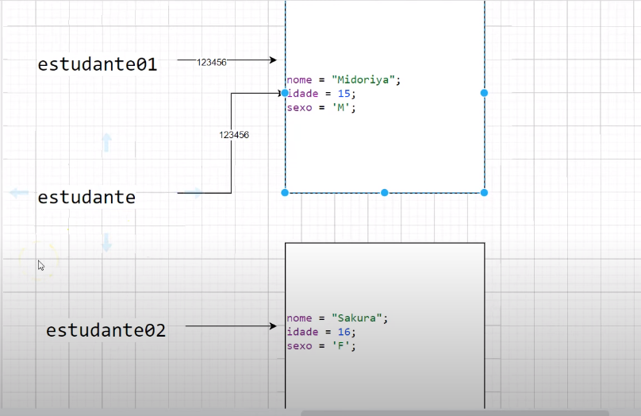

## Java Course - Intermediary

### Topics 
```
Classes 39-43: Introduction To Classes
Classes 44-53: Methods
```

### [Class and object](https://www.javatpoint.com/object-and-class-in-java)

#### What is an object in Java:

An entity that has state and behavior is known as an object.

An object has three characteristics:


- **State:** represents the data (value) of an object.

- **Behavior:** represents the behavior (functionality) of an object such as deposit, withdraw, etc.

- **Identity:** An object identity is typically implemented via a unique ID. The value of the ID is not visible to the external user. However, it is used internally by the JVM to identify each object uniquely.


An object is an instance of a class. A class is a template or blueprint from which objects are created. So, an object is the instance(result) of a class.


#### What is a class in Java:

A class is a group of objects which have common properties. It is a template or blueprint from which objects are created. It is a logical entity. It can't be physical.


### Methods

In Java, a method is like a function which is used to expose the behavior of an object.


### Reference type parameters


Pass-by-reference: When a method is called, the method arguments reference the same variable in memory as the caller.

 

Pass-by-value: When a method is called, the caller passes a copy of the argument variables to the method resulting in two values in memory

### .[This](https://www.guru99.com/java-this-keyword.html)

During code execution when an object calls the method. The keyword ‘this’ is replaced by the object handler “obj.


### Varargs

Varargs is a short name for variable arguments. 


