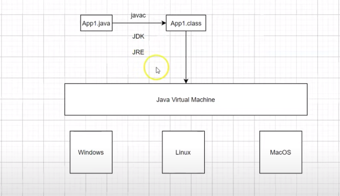

## Java Course - Introduction

### Topics 
>
    Class 00-07: Introduction to Java 
    Class 08-09: Packages, Comments and Output
    Class 10-14: Primitive Data Type and Reference Type String
    Class 15-19: Operators (Arithmetic, Relational, Logical, Assignment)
    Class 20:26: Conditional Statements
    Class 27:31:Loop statements
    Arrays
    Multidimensional Arrays
    Packages
    Classes
    Methods


### Install Java
Download java jdk in *[Azul JDKs](https://www.azul.com/downloads/?package=jdk)*.
Follow this steps to *[Install Java JDK 17 on Windows](https://www.youtube.com/watch?v=QekeJBShCy4)*.
Choose and install one of *[Top 10 popular Java IDE](https://www.edureka.co/blog/top-10-java-ide/)*.

### How Java Works



**JVM (Java Virtual Machine)** = JVM is the runtime engine of the Java Platform, which allows any program written in Java or other language compiled into Java bytecode to run on any computer that has a native JVM. The JVM is specific to each OS.

**JDK (Java Development Kit)** = The JDK has a JVM, a compiler and debugging tools. It is used for development.

**JRE (Java Runtime Environment)** = The JRE is just for executing.

We will compile the `.java` source file and turn it into a `.class` file. This `.class` we call byteCode that will be executed by the JVM. The JVM will interpret and worry about working with the OS.

### Packages
The package structure is a directory structure. Packages serve to organize and group project classes that have things in common.

The convention for naming packages is:
> your inverted website domain -> project name -> what you want to have in your package.

**For example:** 
`academy.devdojo.javacoursedevdojo.introduction`
 
<sub>academy.devdojo = your inverted website domain
javacoursedevdojo = project name
introduction =  what you want to have in your package</sub>

### Comments
> Multiple lines
/**/ 

> Inline
// 

> Javadoc
/* * /* 

> Vs Code Shortcut 
Ctrl + ;

### Usefull Shortcuts
> sout
    `System.out.println();`

> psvm
    `public static void main(String[] args) {}`

### Primitive Data Types


#### Casting
Type casting is when you assign a value of one primitive data type to another type.

- **Widening Casting:**
Converting a smaller type to a larger type size. Is done automatically.
`byte -> short -> char -> int -> long -> float -> double`
</br>

  ``` 
  public class Main {
    public static void main(String[] args) {
        int myInt = 9;
        double myDouble = myInt;
        System.out.println(myInt);      // Outputs 9
        System.out.println(myDouble);   // Outputs 9.0
  }
   ```

- **Narrowing Casting:**
Converting a larger type to a smaller size type. Is done manually by placing the type in parentheses in front of the value.
`double -> float -> long -> int -> char -> short -> byte`
</br>

  ``` 
    public class Main {
        public static void main(String[] args) {
            double myDouble = 9.78d;
            int myInt = (int) myDouble;

            System.out.println(myDouble);   // Outputs 9.78
            System.out.println(myInt);      // Outputs 9
    }
    }
   ```
### Reference Type String

String is a reference type and not a primitive type. String is a Class.

### Operators
